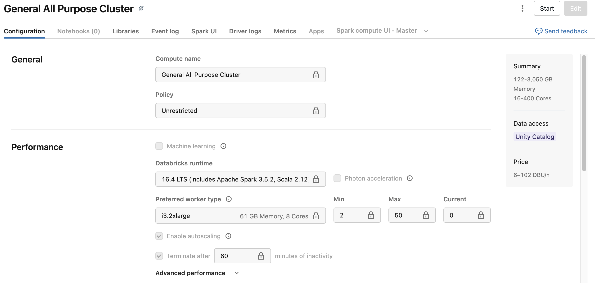

# Databricks in a Nutshell

**A hands-on introduction to Databricks for beginner Data Engineers.**

This project is a step-by-step guide: from “what is Databricks” to a working Bronze → Gold pipeline with a table in Unity Catalog and Power BI connectivity.

---

## Table of Contents

1. [What is Databricks](#1-what-is-databricks)
2. [What Databricks Works With](#2-what-databricks-works-with)
3. [Why Databricks is Useful](#3-why-databricks-is-useful)
4. [Apache Spark and PySpark in Brief](#4-apache-spark-and-pyspark-in-brief)
5. [Workspace Creation and Networking](#5-workspace-creation-and-networking)
6. [Logging into the Workspace. Clusters](#6-logging-into-the-workspace-clusters)
7. [Serverless and Cluster Types in Production](#7-serverless-and-cluster-types-in-production)
8. [Notebooks, Jobs, and Schedules](#8-notebooks-jobs-and-schedules)
9. [Storage: DBFS and Storage Types](#9-storage-dbfs-and-storage-types)
10. [Autoloader (Streaming) vs Batch](#10-autoloader-streaming-vs-batch)
11. [Practice: Bronze → Gold Pipeline](#11-practice-bronze--gold-pipeline)
12. [Unity Catalog and Tables](#12-unity-catalog-and-tables)
13. [Connecting Power BI](#13-connecting-power-bi)
14. [GitHub and Databricks Repos](#14-github-and-databricks-repos)

---

## 1. What is Databricks

**Databricks** is a cloud platform for data and ML built on **Apache Spark** (we cover Spark in [Section 4](#4-apache-spark-and-pyspark-in-brief)).

- It is **compute**, not storage: data can live in S3, ADLS, GCS, or DBFS.
- Databricks provides: Workspace (notebooks, jobs, MLflow), cluster management, Unity Catalog, and integrations with clouds (AWS, Azure, GCP).
- The idea: one product for ETL, analytics, ML, and collaboration.

### Official diagrams

- **[High-level architecture](https://docs.databricks.com/en/getting-started/overview.html)** — Databricks object hierarchy, classic and serverless workspace architecture (official docs).
- **[Architecture (AWS)](https://docs.databricks.com/aws/en/getting-started/architecture)** — Control plane, compute plane, and workspace storage on AWS.
- **[Lakehouse platform](https://docs.databricks.com/en/lakehouse/index.html)** — Lakehouse overview and platform scope.

  
*Source: [Databricks Lakehouse](https://docs.databricks.com/en/lakehouse/index.html)*

---

## 2. What Databricks Works With

| Component | Role |
|-----------|------|
| **AWS / Azure / GCP** | Infrastructure: VPC, storage (S3, ADLS, etc.), IAM |
| **Apache Spark** | Distributed compute engine |
| **Delta Lake** | Table format on top of Parquet with ACID and time travel |
| **Unity Catalog** | Unified metadata catalog, access control, lineage |
| **DBFS** | Workspace’s internal file storage (Managed Storage) |
| **GitHub / Git** | Code versioning, CI/CD |

---

## 3. Why Databricks is Useful

- **Single platform**: ETL, streaming, ML, SQL, BI — without juggling multiple tools.
- **Scale**: Spark scales across nodes; you can size the cluster to the workload.
- **Cluster management**: auto start/stop, serverless — less manual tuning.
- **Unity Catalog**: one catalog for tables and permissions across the organization.
- **Cloud integration**: native S3/ADLS, IAM, private networking.

---

## 4. Apache Spark and PySpark in Brief

### Apache Spark — the engine

**Apache Spark** is a **unified analytics engine** for distributed processing of large data (batch and streaming). It runs on a cluster: one **driver** coordinates the job, and **executors** on worker nodes run tasks and hold data. Spark handles distribution, scheduling, and fault tolerance — you write high-level logic (read, transform, write), and the engine parallelizes it across nodes.

  
*Source: [Apache Spark — Cluster Mode Overview](https://spark.apache.org/docs/latest/cluster-overview.html)*

### RDD / DataFrame / Dataset

- **RDD** (Resilient Distributed Dataset) — low-level, immutable distributed collection; flexible but more verbose.
- **DataFrame** — table-like API with named columns and a schema; optimized by the Catalyst optimizer. In day-to-day work you mostly use **DataFrame** (or Dataset in Scala/Java).
- **Dataset** — typed API on top of DataFrame (strong in Scala/Java; in Python, DataFrame is the main abstraction).

### PySpark — why it’s convenient

**PySpark** is the Python API for Spark: `spark.read`, `df.write`, SQL via `spark.sql()`. It’s convenient because:

- **Familiar language** — Python is widely used in data engineering and analytics; no need to learn Scala/Java to use Spark.
- **Single API for batch and streaming** — same DataFrame/SQL API for batch jobs and structured streaming.
- **Rich ecosystem** — Spark SQL, DataFrames, MLlib, and integration with Pandas (e.g. `df.toPandas()`, `spark.createDataFrame(pandas_df)`).
- **You don’t write distributed code** — you write transformations (filter, join, aggregate); Spark distributes data and work across the cluster. No manual multi-threading or task partitioning.

Example:

```python
df = spark.read.json("/path/to/file.json")
df.write.mode("overwrite").parquet("/path/to/output")
```

Spark splits the data into partitions and runs tasks on the executors; the same code scales from one machine to many nodes.

### Query plan and physical plan

When you build a DataFrame or run SQL, Spark does **not** execute it immediately. It first builds a **logical plan** (what to do) and then a **physical plan** (how to run it on the cluster). Understanding both helps with debugging and tuning.

**How to view plans in PySpark / Databricks:**

```python
# Logical plan only
df.explain(mode="simple")   # or df.explain()

# Logical + physical (default in many Spark versions)
df.explain(mode="extended")

# Formatted (easier to read in notebooks)
df.explain("formatted")

# With cost info (if supported)
df.explain(mode="cost")
```

Use these when a query is slow or behaves oddly: check whether filters are pushed down to the source, whether the join strategy (broadcast vs sort-merge) is what you expect, and where shuffles occur.

---

## 5. Workspace Creation and Networking

The Workspace is created in the cloud console (AWS/Azure) or via the Databricks partner portal. It’s important to know **where** this Databricks will “point” — that drives network and data access.

### Why Networking Matters

- Databricks clusters must **reach** storage (S3, ADLS, internal DBs) and your network (VPN, VPC).
- Network setup affects: security, privacy, and compliance with corporate policies.

As a data engineer you will likely work on a platform where access is already configured (VPC, PrivateLink, etc.). Networking is a large topic in its own right, and connectivity issues between Databricks and the cloud (or on‑prem) often come from here — so it helps to know the basics and where to look when something fails to connect...
But we will keep this topic for another session

### By Cloud

| Cloud | What to Configure |
|-------|-------------------|
| **AWS** | VPC, subnets, security groups; S3 endpoint or NAT for internet; optionally PrivateLink / VPC endpoint for Databricks. |
| **Azure** | VNet, subnets, Private Endpoints to ADLS and Databricks; optionally Secure Cluster Connectivity (no public IP). |
| **GCP** | VPC, firewall; optionally Private Service Connect. |

### Basic architecture: Databricks and the cloud (networking)

Databricks uses a **two-plane** model: the **control plane** (Databricks-managed: UI, APIs, job scheduling) and the **compute plane** (where your clusters run and data is processed). In the classic setup, the compute plane lives in **your** cloud account (e.g. your VPC on AWS); the control plane is in Databricks’ account. The diagram below shows how the workspace and your cloud account connect.

  
*Source: [Databricks on AWS — High-level architecture](https://docs.databricks.com/aws/en/getting-started/high-level-architecture)*

**What you can change vs what only Databricks can change**

| You (customer) can change | Only Databricks can change |
|---------------------------|----------------------------|
| Your VPC, subnets, security groups, NACLs in your cloud account | Control plane: backend services, web app, APIs, job scheduler |
| Customer-managed VPC (if you use it): CIDR, DNS, routing | Where and how the control plane is hosted |
| PrivateLink / VPC endpoints on your side; connectivity from your network to Databricks | PrivateLink / connectivity on Databricks’ side (their account, their endpoints) |
| Workspace-level settings you have access to (e.g. IP access lists, some network options in the UI) | Serverless compute plane (if used): runs in Databricks’ account; networking there is managed by Databricks |
| Firewall and egress rules for your compute (classic) in your VPC | Changes to regions, availability, or architecture of the control plane |

If you need something that only Databricks controls (e.g. enable PrivateLink for your workspace, change control-plane region, open a new capability), you have to **contact Databricks** (support ticket, account team, or partner). You cannot change the control plane or Databricks-side networking yourself.

Recommendation: for production use **private** options (PrivateLink, Secure Cluster Connectivity) so traffic doesn’t go over the public internet.

Details: [AWS](https://docs.databricks.com/administration-guide/cloud-configurations/aws/index.html), [Azure](https://docs.databricks.com/administration-guide/cloud-configurations/azure/index.html).

---

## 6. Logging into the Workspace. Clusters

After creating the Workspace, open a URL like `https://<workspace>.cloud.databricks.com` (or Azure/GCP domain). Log in via SSO or email/password, depending on your org’s settings.

### What is a Cluster

A **cluster** in Databricks is a set of VMs (driver + workers) that run Spark.

- **Driver** — one node: coordinates tasks, holds session metadata.
- **Workers** — nodes that run the actual work. More workers / more cores and memory → heavier workloads.

Without a cluster you cannot run any notebook cell or Job.

### Cluster Types

| Type | Description |
|------|-------------|
| **All-purpose (Interactive)** | For interactive work: notebooks, ad-hoc queries. Stays up until you stop it (or timeout). |
| **Job** | Started for a specific Job and terminates when the Job finishes. Saves cost. |
| **Pool (Cluster pool)** | A pool of “warm” nodes; Job clusters from the pool start faster than from scratch. |

### All-purpose cluster: configuration example

In the cluster **Configuration** tab you set the compute name, policy, **Databricks runtime** (e.g. 16.4 LTS with Spark 3.5.2), optional **Photon acceleration**, **worker type** (e.g. i3.2xlarge — memory and cores), **autoscaling** (min/max workers), and **termination** (e.g. after 60 minutes of inactivity). The **Summary** panel shows total memory and cores for the cluster, data access (Unity Catalog), and estimated price (DBU/h).

  
*Configuration tab: runtime, worker type, autoscaling, termination, and summary (memory, cores, price).*

Under **Advanced options** → **Spark** (or **Advanced performance** in the UI) you can add custom Spark configuration properties (see below).

### Additional Spark settings

You can pass extra Spark and Hadoop options to the cluster via the **Spark** config section (Advanced options). Examples that are often used with AWS and Unity Catalog / Glue:

| Setting | Example value | Purpose |
|---------|----------------|--------|
| `spark.databricks.acl.sqlOnly` | `true` | Restrict cluster to SQL-only access (e.g. for BI). |
| `spark.databricks.hive.metastore.glueCatalog.enabled` | `true` | Use AWS Glue as Hive metastore (when integrating with Glue). |
| `spark.driver.maxResultSize` | `200g` | Max size of result set the driver can collect (avoid OOM on large pulls). |
| `spark.hadoop.aws.glue.cache.db.enable` | `true` | Enable Glue DB cache. |
| `spark.hadoop.aws.glue.cache.db.size` | `1000` | Glue DB cache size. |
| `spark.hadoop.aws.glue.cache.db.ttl-mins` | `30` | Glue DB cache TTL (minutes). |
| `spark.hadoop.aws.glue.cache.table.enable` | `true` | Enable Glue table cache. |
| `spark.hadoop.aws.glue.cache.table.size` | `1000` | Glue table cache size. |

Add these as **Spark** → **Spark config** key-value pairs in the cluster configuration. Exact keys and supported options depend on your Databricks runtime and cloud (AWS/Azure); check the docs for your version.

For when to use which cluster type in production, see [Section 7](#7-serverless-and-cluster-types-in-production).

---

## 7. Serverless and Cluster Types in Production

You can use **Serverless** (where available): the cluster is not “your” set of VMs but an abstraction — Databricks allocates and releases resources.

### When to Use What

| Scenario | Recommendation |
|----------|----------------|
| **Development, experimentation** | All-purpose cluster (or Serverless SQL/notebooks if enabled). |
| **Production: predictable Jobs** | **Job cluster** (or **Serverless Jobs**) — start, run, shut down. |
| **Production: many short Jobs** | **Serverless** or **Cluster pool** + Job clusters from the pool — less cold start. |
| **Production: strict resource control** | **Dedicated Job clusters** with fixed instance types. |
| **Production: SQL Warehouse / BI** | **Serverless SQL** (if available) — no need to keep a cluster for dashboards. |

Summary for production:

- **Dedicated / Job clusters** — when you need predictable instances and isolation.
- **Serverless** — when you want simplicity and fast startup without managing nodes.
- **Cluster pool** — when you have many Jobs and care about startup time (reusing warm nodes).

**Serverless Workspace** (if you have that option): a Workspace where some compute is serverless by default (e.g. SQL Warehouses and sometimes Jobs). Good for teams that want less infra to manage; for heavy or special workloads you can still use regular clusters.

---

## 8. Notebooks, Jobs, and Schedules

- **Notebook** — interactive environment (code cells, markdown). Runs on a chosen cluster. Good for development and debugging.
- **Job** — a task that runs one or more notebooks/scripts (or JAR) **non-interactively**. Trigger: manual or **schedule** (cron).
- **Schedule** — in the Job settings you set a schedule (e.g. daily at 02:00). This is how production pipelines are usually run.

Practice: develop in a notebook → turn it into a Job → add a schedule.

---

## 9. Storage: DBFS and Storage Types

### DBFS (Databricks File System)

**DBFS** is a file-system abstraction that your Workspace sees. It sits on top of cloud storage.

- In many setups, the DBFS root is backed by **Managed Storage** — storage that Databricks creates and manages for that Workspace (e.g. an S3 bucket or ADLS container).
- Paths like `/FileStore/` (e.g. `/FileStore/tables/...`) are DBFS. To upload files or browse this storage in the UI, use **New** → **Data** (or **Create** → **Data**), then choose one of: **DBFS** (legacy file upload to FileStore), **Upload files to volume** (Unity Catalog volume), or **Create or modify table** (ingest into a Delta table). From a notebook you may see **File** → **Add data**. The exact menu labels can vary by Databricks version; if you don’t see these options, your org may have disabled the upload UI or use a different layout — see [Load data using the add data UI](https://docs.databricks.com/en/ingestion/add-data/index.html) and [Upload files to Databricks](https://docs.databricks.com/en/ingestion/file-upload) for the current paths.

### Storage Types

| Type | Description |
|------|-------------|
| **Managed (DBFS root / FileStore)** | Created and managed by Databricks. Convenient for artifacts, small files, demos. |
| **External / Customer-managed** | Your S3 bucket / ADLS container. You control lifecycle and access. Production data often lives here. |
| **Unity Catalog Volumes** | Folders inside a UC catalog for files (e.g. for ML and shared datasets). |

In the practice section we put JSON in this storage (e.g. a folder in DBFS/Managed), then read it from a notebook and write Bronze/Gold.

---

## 10. Autoloader (Streaming) vs Batch

In the [practice](#11-practice-bronze--gold-pipeline) we use **batch** ingestion: each run reads all data from the source (e.g. `spark.read.json(path)`) and overwrites or appends. For incremental or near real-time loads, Databricks offers **Auto Loader** (Structured Streaming source `cloudFiles`).

| Aspect | Batch | Auto Loader (streaming) |
|--------|--------|--------------------------|
| **What it does** | Reads all files in the path (or partition) on each run. | Tracks processed files via checkpoints; only **new** files are read on each run. |
| **When to use** | One-off or scheduled full refresh; simple pipelines; no need to avoid reprocessing. | New files arriving continuously or on a schedule; you want to avoid rereading the same data. |
| **Latency** | Depends on schedule (e.g. daily at 02:00). | Near real-time if running as a streaming query; or use `Trigger.AvailableNow` for “batch-style” runs with incremental reads. |
| **Cost** | Simpler; you pay per run for the data scanned. | Checkpoint and (optionally) file notification (events) add a bit of setup; often cheaper than reprocessing everything. |

**Auto Loader** discovers new files in cloud storage (S3, ADLS, etc.), infers schema, and supports exactly-once semantics. For production, Databricks often recommends Auto Loader with **batch triggers** (e.g. `Trigger.AvailableNow`) instead of continuous streaming when low latency is not required — same incremental behavior with lower compute cost. See [What is Auto Loader?](https://docs.databricks.com/en/ingestion/auto-loader/index.html) and [Batch vs. streaming](https://docs.databricks.com/en/ingestion/streaming) in the docs.

---

## 11. Practice: Bronze → Gold Pipeline

This section walks through a minimal end-to-end pipeline: raw JSON → Bronze (Parquet) → Gold (Delta) → table in Unity Catalog. Each layer has a clear role.

### Overview

| Layer   | Role                                      | Format   | Where                         |
|---------|-------------------------------------------|----------|-------------------------------|
| **Input** | Raw file you upload                      | JSON     | UC Volume `firstdbfs_surfaltics` |
| **Bronze** | Raw data, minimal changes, columnar     | Parquet  | `.../bronze/events/`          |
| **Gold**   | Clean, deduplicated, ready for BI/UC   | Delta    | `.../gold/events/`            |
| **Table**  | Registered in UC for SQL/BI            | Delta    | Unity Catalog `catalog.schema.table` |

---

### Step 1 — Prepare and upload JSON to a Unity Catalog Volume

We use the Unity Catalog Volume **`firstdbfs_surfaltics`** (catalog `workspace`, schema `default`). Path: **`/Volumes/workspace/default/firstdbfs_surfaltics`**.

1. **Get a JSON file**  
   Use any small JSON (e.g. `data/sample.json` from this repo). The file should be one JSON object per line (NDJSON) so `spark.read.json()` can read it as a table.

2. **Open the Volume in the Workspace**  
   **Catalog** → **workspace** (or your catalog) → **Volumes** → open **firstdbfs_surfaltics** (or create a volume in schema `default`). Upload `sample.json` into the volume (at the root or in a subfolder, e.g. `bronze/input/`). If your UI differs, see [Load data](https://docs.databricks.com/en/ingestion/add-data/index.html) in the docs.

3. **Paths used in this practice**  
   - Input JSON: `/Volumes/workspace/default/firstdbfs_surfaltics/sample.json` (or `.../bronze/input/sample.json` if you use a subfolder).  
   - Bronze (Parquet): `/Volumes/workspace/default/firstdbfs_surfaltics/bronze/events`.  
   - Gold (Delta): `/Volumes/workspace/default/firstdbfs_surfaltics/gold/events`.

4. **Why this step**  
   We put the raw file in a known Volume path so the Bronze notebook can read it. Unity Catalog Volumes live under `/Volumes/<catalog>/<schema>/<volume>/`; in production you might also read from S3/ADLS.

---

### Step 2 — Bronze: read JSON, write Parquet

1. **Create or open the Bronze notebook**  
   **Workspace** → **Create** → **Notebook** (or open from Repos: `notebooks/01_bronze_ingest.py`). Set the default language to **Python** and attach a **cluster**.

2. **Set paths**  
   In the first cell, set the path to the JSON in the Volume and the Bronze output folder:
   ```python
   input_path = "/Volumes/workspace/default/firstdbfs_surfaltics/sample.json"
   bronze_path = "/Volumes/workspace/default/firstdbfs_surfaltics/bronze/events"
   ```
   If you uploaded `sample.json` into a subfolder (e.g. `bronze/input/`), set `input_path` to `.../firstdbfs_surfaltics/bronze/input/sample.json`.

3. **Read JSON and write Parquet**  
   ```python
   df = spark.read.json(input_path)
   df.write.mode("overwrite").format("parquet").save(bronze_path)
   ```
   - `spark.read.json(...)` infers the schema from the JSON and returns a DataFrame.
   - `df.write.mode("overwrite").format("parquet").save(...)` writes the data in Parquet format under `bronze/events/`. Parquet is columnar and efficient for analytics.

4. **Verify**  
   Run:
   ```python
   spark.read.parquet(bronze_path).show(5)
   ```
   You should see the same rows. In **Data** → browse to `bronze/events/` and you’ll see the Parquet files.

5. **Why Bronze**  
   Bronze = “raw but in a stable format”. We don’t change the data much; we just move it from JSON to Parquet and put it in a dedicated folder. Later steps read from Bronze, not from the original JSON.

---

### Step 3 — Gold: read Bronze (Parquet), write Gold (Delta)

1. **Create or open the Gold notebook**  
   New notebook or open `notebooks/02_gold_transform.py`. Attach the same cluster (or another one).

2. **Set paths**  
   ```python
   bronze_path = "/Volumes/workspace/default/firstdbfs_surfaltics/bronze/events"
   gold_path = "/Volumes/workspace/default/firstdbfs_surfaltics/gold/events"
   ```

3. **Read from Bronze, optionally transform, write to Gold**  
   ```python
   df = spark.read.parquet(bronze_path)
   # Optional: df = df.filter(...).select(...).dropDuplicates(...)
   df.write.mode("overwrite").format("delta").save(gold_path)
   ```
   - We read the Parquet data from Bronze.
   - You can add filters, renames, aggregations, or deduplication here (Gold = “clean, business-ready”).
   - We write as **Delta** so we get ACID and time travel; Delta is the recommended format for tables in Unity Catalog.

4. **Verify**  
   ```python
   spark.read.format("delta").load(gold_path).show(5)
   ```
   In **Catalog** → **workspace** → **Volumes** → **firstdbfs_surfaltics**, browse to `gold/events/` to see the Delta table files.

5. **Why Gold**  
   Gold = “final” layer for reporting and sharing. One folder, one logical dataset, in Delta format. Next we expose it as a table in Unity Catalog.

---

### Step 4 — Register the Gold table in Unity Catalog

Unity Catalog **does not** support `CREATE TABLE ... LOCATION` on a path inside a Volume (or using the `dbfs:` scheme). You get: *"Creating table in Unity Catalog with file scheme dbfs is not supported"*. Tables and Volumes cannot overlap.

1. **Create a managed table from the Gold data in the Volume**  
   In the same Gold notebook (or a SQL notebook), run:
   ```sql
   CREATE OR REPLACE TABLE workspace.default.gold_events
   AS SELECT * FROM delta.`/Volumes/workspace/default/firstdbfs_surfaltics/gold/events`;
   ```
   Replace `workspace.default` with your `catalog.schema` if different. This creates a **managed** table: data is stored in the catalog’s managed storage (a copy from the Volume). The Delta files in the Volume remain.

2. **What this does**  
   Unity Catalog now has a table `workspace.default.gold_events` that you can query and connect to Power BI. The table data lives in UC managed storage; the Volume path is only the source for the initial copy.

3. **Verify**  
   ```python
   spark.table("workspace.default.gold_events").show(5)
   ```
   Or in a SQL cell: `SELECT * FROM workspace.default.gold_events LIMIT 5;`

**Alternative:** To keep data in one place (external table), write Gold to an **external location** (S3/ADLS path registered in UC), then `CREATE TABLE ... USING DELTA LOCATION 's3://bucket/path'` (cloud URI, not Volume path).

---

### Step 5 — Use the table (e.g. Power BI)

Once the table is in Unity Catalog, you connect your BI tool to the Workspace and choose **Unity Catalog** → catalog → schema → `gold_events`. No need to point at DBFS paths; the table is the entry point. See [Section 13](#13-connecting-power-bi) for Power BI steps.

---

### Summary

| Step | Action | Result |
|------|--------|--------|
| 1 | Upload JSON to Volume `firstdbfs_surfaltics` | Raw file at e.g. `/Volumes/workspace/default/firstdbfs_surfaltics/sample.json` |
| 2 | Bronze notebook: read JSON → write Parquet | Data in `.../firstdbfs_surfaltics/bronze/events/` (Parquet) |
| 3 | Gold notebook: read Parquet → write Delta | Data in `.../firstdbfs_surfaltics/gold/events/` (Delta) |
| 4 | Register table in Unity Catalog | Table `main.default.gold_events` (or your catalog.schema) |
| 5 | Connect Power BI (or SQL) | Reports and queries on `gold_events` |

Full step-by-step and troubleshooting: [PRACTICE.md](PRACTICE.md).

---

## 12. Unity Catalog and Tables

- **Unity Catalog (UC)** — unified metadata catalog: schemas, tables, views, permissions (GRANT/REVOKE).
- We **register** the gold table in UC (`CREATE TABLE ... USING delta LOCATION '...'` or `CREATE TABLE ... AS SELECT ...`).
- After that, the table is accessed by three-level name: `catalog.schema.table`. That’s what Power BI connects to.

---

## 13. Connecting Power BI

- In Power BI: **Get data** → **Azure Databricks** (or **Databricks**).
- Enter **Server hostname** (Workspace URL), **HTTP path** (from cluster or SQL Warehouse), and authentication (usually Personal Access Token or OAuth).
- Choose **Unity Catalog** (or legacy Hive metastore): catalog, schema, gold table.
- Build a report on that table.

For production, use a **SQL Warehouse** (including Serverless) as the BI entry point, not an interactive cluster.

---

## 14. GitHub and Databricks Repos

Code should live in **GitHub** (or another Git), and in Databricks connect via **Repos**.

- **User Settings** → **Git Integration** → connect GitHub (token with `repo` scope).
- In the Workspace: **Repos** → **Add Repo** → repository URL. Develop notebooks and scripts in the repo (or sync with it).
- Jobs should run from the `main` branch so production always uses a committed version.

Result: single source of truth for code (GitHub), versioning, code review, and safe deployments.

---

## Project Architecture (Summary)

```
GitHub (code)
    ↓ Repos
Databricks Workspace
    ↓ Jobs / Notebooks
DBFS / External Storage (Bronze → Gold)
    ↓
Unity Catalog (tables)
    ↓
Power BI (and other BI tools)
```

---

## Repository Structure

```
Databricks-Project-Sa/
├── README.md                 # this guide
├── PRACTICE.md               # step-by-step Bronze → Gold practice
├── notebooks/
│   ├── 01_bronze_ingest.py   # read JSON → write to bronze (Parquet/Delta)
│   └── 02_gold_transform.py  # read bronze → write to gold + UC table
├── data/
│   └── sample.json           # sample JSON to upload to DBFS
└── jobs/
    └── daily_pipeline.json   # example Job config (optional)
```

---

## What You’ll Get After Completing

- Understanding: what Databricks is, Spark/PySpark, Workspace, clusters, serverless.
- Awareness of networking when deploying (AWS/Azure).
- Hands-on: upload to DBFS, Bronze → Gold notebooks, table in Unity Catalog, Power BI connection.
- Working with code via GitHub and Databricks Repos.

If you want to expand any section into a separate file (e.g. networking or clusters only), you can move it to `docs/` and link from this README.
